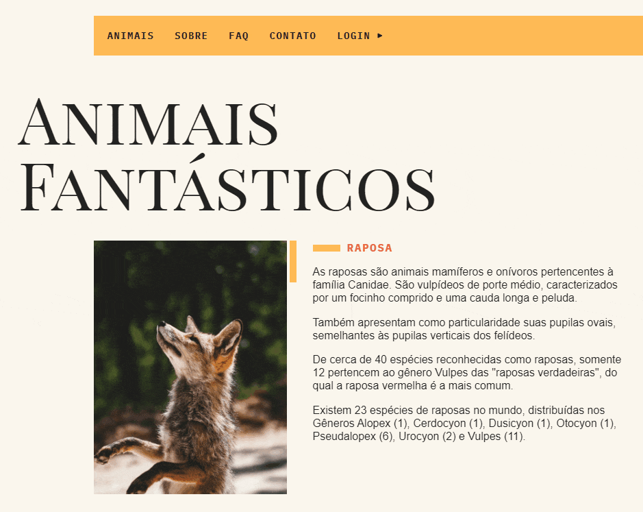
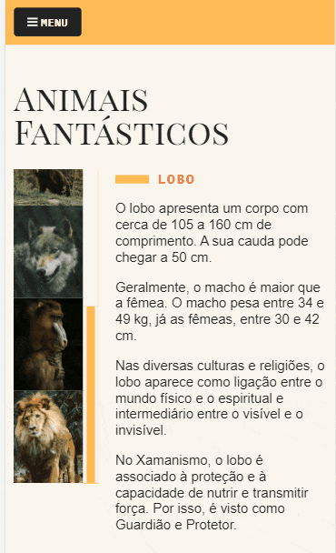
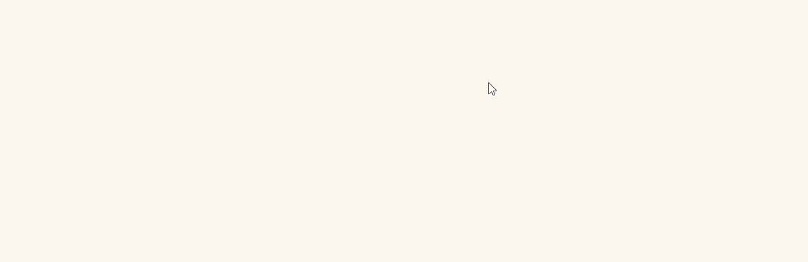
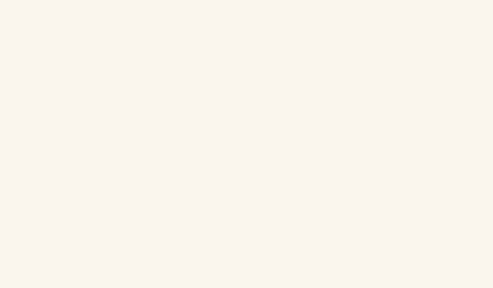
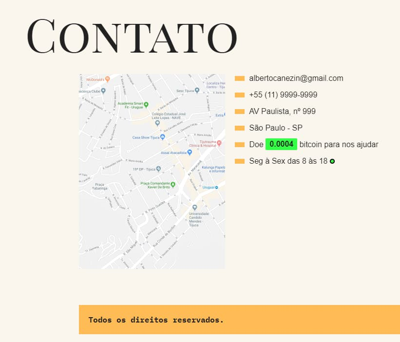

# Animais Fantásticos

<p style="font-size: 16px;">Animais Fantásticos é um site fictício de alguns animais, esta página é feita com diversas animações e interaçãoes com JavaScript puro sem usar nenhum plugin, ou ferramenta externa, tudo foi desenvolvido do zero. <br>
Este projeto foi desenvolvido durante meu aprendizado no curso de JavaScript ES6+ completo na Origamid.</p>

- Foi desenvolvido com boas práticas em JavaScript
- É totalmente responsivo
- Foi utilizado diversas técnicas com JavaScript

## Técnologias Utilizadas

- JavaScript
- WebPack
- CSS3 - FlexBox - CSS Grid
- HTML5

## Visual do Animais Fantásticos

<p>Introdução</p>


<br>
<p>Menu Mobile</p>


<br>
<p>Perguntas</p>


<br>
<p>Slide de imagens</p>


<br>
<p>Numeros</p>


<br>
<p>Contato</p>


## Visualize todo o projeto em

<a href="https://canezinbeto.github.io/animais-fantasticos/" target="_blank">https://canezinbeto.github.io/animais-fantasticos/</a>

## Para testar na sua máquina

<p>Pré-requisitos</p>
<p>Você precisa ter instalado na sua máquina as ferramentas: <a href="https://git-scm.com/">Git</a>, <a href="https://nodejs.org/en/">Node.js</a> e também <a href="https://code.visualstudio.com/">Vscode</a> com a extensão liveServer</p>

```bash
# Basta clonar o repositório em sua máquina
$ git clone git@github.com:CanezinBeto/animais-fantasticos.git

# Instalar as dependências
npm init

# Abrir com o Vscode e visualizar com o liveServer
```

Desenvolvido por Alberto Canezin :rocket: [veja meu LinkeIn](https://www.linkedin.com/in/albertocanezin-dev/)
